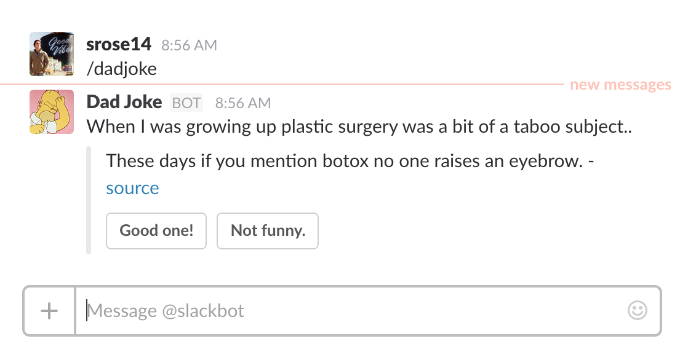

# Slack Dad Jokes
An utterly fantastic Slack integration for classic dad jokes.

[](https://codeclimate.com/github/samrose3/dadjokes)



## Install
Add to your Slack
[https://dadjokes.samrose3.com](https://dadjokes.samrose3.com)

## Usage
In a Slack channel or direct message, use the slash command `/dadjokes`.

## Running Locally
1. Download the repo 

    ```bash
    git clone https://github.com/samrose3/dadjokes.git
    cd  dadjokes
    ```
1. Build the static web site

    ```bash
    gulp
    ```
1. Create your virtual environment ([virtualenv](https://pypi.python.org/pypi/virtualenv) or [virtualenvwrapper](https://pypi.python.org/pypi/virtualenvwrapper))
1. With your environment active, install the required python packages

    ```bash
    pip install -r requirements.txt
    ```
1. Start up the server locally

    ```bash
    python manage.py runserver
    ```
1. Go check it out [http://127.0.0.1:8000](http://127.0.0.1:8000/)
1. Test out the API:
    - Jokes [/api/v1/jokes](http://127.0.0.1:8000/api/v1/jokes)
